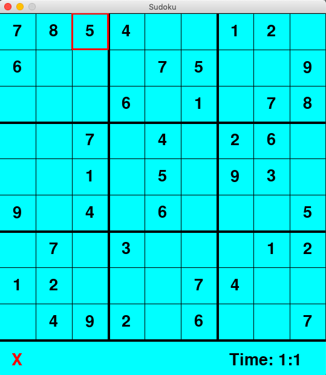

# Sudoku

A Sudoku solver built in Python using a backtracking algorithm. Includes GUI(built with Pygame) and Console implementations.

## Setup

You need to have Python on your system to run this.
1. Clone this repository to your system.
2. Install Pygame:```pip install pygame``` 
3. Navigate to this directory and run ```python3 Sudoku-GUI.py```

## Terminal Screenshot


Original solved sudoku (terminal) 

## GUI Screenshot (Pygame)


GUI Sudoku Board


Temporary Sketched Value



Final correct value
